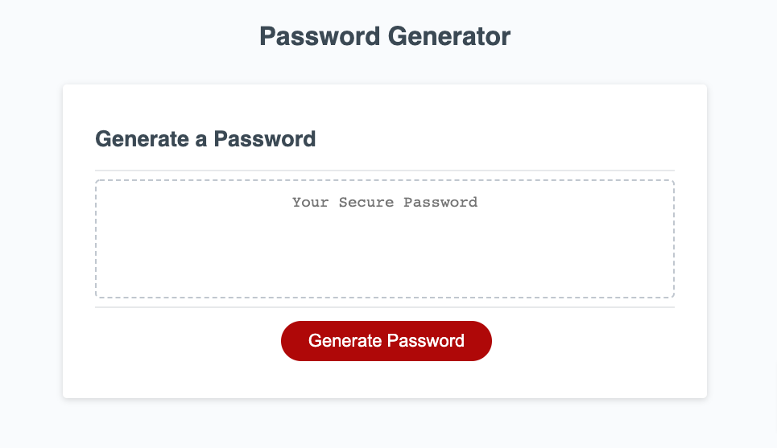

# Password Generator
***
## Description
___
Password Generator is a web application that allows users to generate passwords inside their browser.
* This app is built with HTML, CSS and Javascript.
* Users have different options to control how passwords are generated, including uppercase, lowercase letters, numbers and special symbols.
* It is safe to use since no network request is made.
## Screenshot of the application
---

## Link to deployed the application
---
[https://daisyle0203.github.io/uta_password_generator/](https://daisyle0203.github.io/uta_password_generator/)